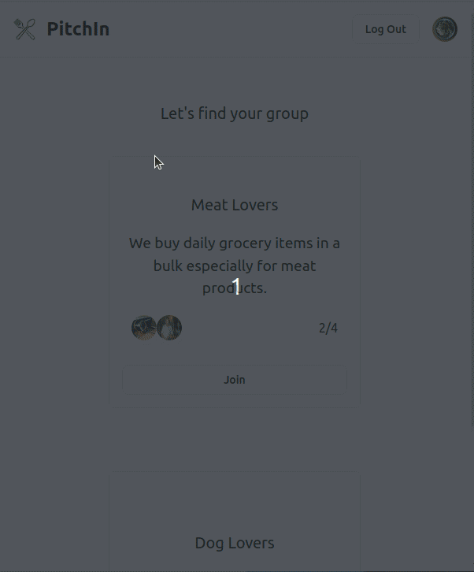

# PitchIn

PitchIn is the place where people unite to buy items together in bulk and save up money in this high-inflation society.

## Demo

[Demo Video Link](https://www.youtube.com/watch?v=9qADD4GFxys)

## How to run it locally

1. run `npm install` in client and server folder
2. run `node setup_db.js` in the server folder after entering your MongoDB URL.
3. run client and server with `npm start`

## Auth0

Referred to [the guide](https://developer.auth0.com/resources/guides/spa/react/basic-authentication) to implement Auth0 with React Application.
